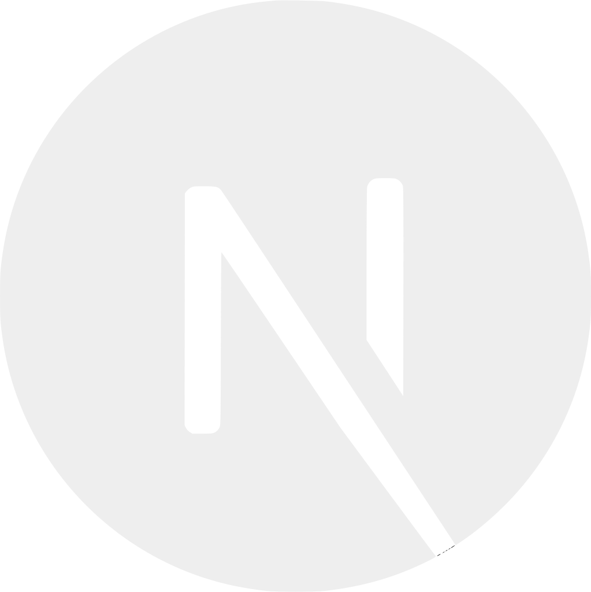

### Hi there, I'm [Farooq Seedat][website] 👋

---

I'm a full stack developer with keen interest in backend technologies. I really enjoy learning new languages and frameworks. I also enjoy learning different System Architectures and Designs.
 

### Connect with me:

[][github]
[][linkedin]
[][stackoverflow]
[][website]
[][medium]
[][facebook]

### Languages and Tools:

 
 

---

### Trophies:

---

[github]: https://github.com/farooqseedat/
[stackoverflow]: https://stackoverflow.com/users/11838178/farooq-seedat
[website]: https://farooqseedat.me
[linkedin]: https://www.linkedin.com/in/farooq-seedat-375a54184/
[medium]: https://medium.com/@farooqseedat
[facebook]: https://www.facebook.com/iamfarooqseedat
